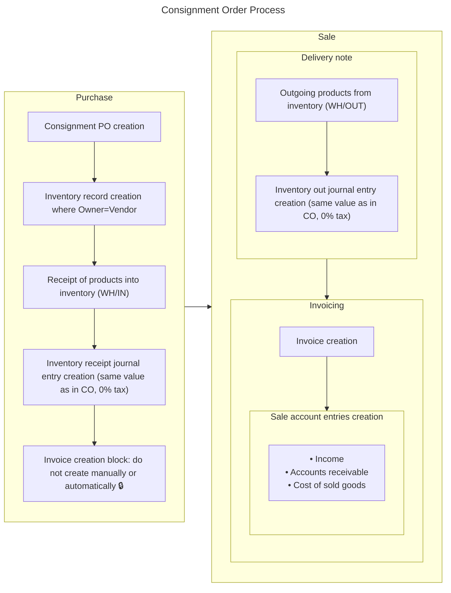
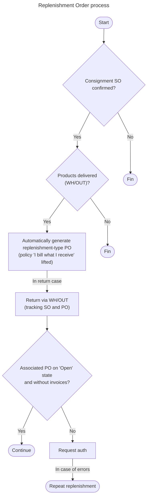

# Consignación

## Consignment order

### Detalles del desarrollo de orden de consignación

1. _Purchase Order (`purchase.order`) model modifications:_
   1. New field: order_type
      - Type: Selection
      - Required: `true`
      - Options:
        - Purchase Order: `purchase_order`
        - Consignment Order: `consignment_order`.
   1. New sequence for SO type **consignment order**: format **CXXXXX**
   1. Custom email templates
1. _Inventory modifications:_
   1. Modify the `_should_exclude_for_valuation` function (`stock.move`, `stock.move.line` and `stock.quant`) to ensure the saving of accounting entries **when the owner is set up** and is different from company.
   1. Create a configuration at product, product category and settings level to specify **input**, **output** and **valuation** accounts for consignment inventory.
   1. Ensure creation of inventory receipt and issue journal entries between warehouses (currently no journal entries are kept on transfers between 2 internal locations).

> Consignment Order view example

## Replenishment order (RO)

Replenishment orders are used to replenish consignment goods. They should not be created manually or automatically to ensure internal system control.

They are created after the confirmation of a SO (`sale.order`, sale) of consignment products and their delivery, so they are associated with an inventory output (`stock.picking`, WH/OUT).

Their purpose is to generate a PO (`purchase.order`) addressed to the corresponding supplier in the inventory output.

### Details of the replenishment order development

1. _Purchase Order (`purchase.order`) model modifications:_
   1. If the type of the Purchase Order is `consignment_order`, a new boolean field `is_replenishment` should be displayed.
   1. If `is_replenishment` is true, a new selection field `replenishment_stage` should appear with the following options:
      - Open: `open` (order is active, but the replenishment has not yet been received from the supplier)
      - Partially replenished: `partially_replenished` (supplier delivered a part of the quantities ordered, but the replenishment is not complete)
      - Replenished: `replenished` (order has been completely fulfilled by the supplier, and the quantities ordered are already recorded in inventory)
      - Closed without replenishment: `closed` (order is closed **manually** because it is decided not to continue with the replenishment)
1. _Stock Picking (`stock.picking`) model modifications:_
   2. When replenishing goods, the system must ensure that the owner at receipt is the same as the owner at CO (lock `owner`).

> Replenishment Order view example

## Consignment and replenishment accounting mapping

### 1. Goods receipt (goods receipt, WH/IN)

| Account | Description                                         | Debit              | Credit             |
| ------- | --------------------------------------------------- | ------------------ | ------------------ |
| 8135    | Goods on consignment (customer control)             | :heavy_check_mark: |                    |
| 8235    | Consignment goods offsetting entry (vendor control) |                    | :heavy_check_mark: |

### 2. Sales (product referral, WH/OUT)

| Account | Description                                              | Debit              | Credit             |
| ------- | -------------------------------------------------------- | ------------------ | ------------------ |
| 8136    | Consignment goods pending to be invoiced to the customer | :heavy_check_mark: |                    |
| 8135    | Goods on consignment                                     |                    | :heavy_check_mark: |

### 3. Billing

| Account | Description                         | Debit              | Credit             |
| ------- | ----------------------------------- | ------------------ | ------------------ |
| 6135    | Cost of goods sold                  | :heavy_check_mark: |                    |
| 8136    | Consignment goods pending invoicing |                    | :heavy_check_mark: |

### 4. Creation of replenishment type appropriation requests

| Account | Description                        | Debit              | Credit             |
| ------- | ---------------------------------- | ------------------ | ------------------ |
| 8135    | Goods on consignment               | :heavy_check_mark: |                    |
| 8235    | Consignment goods offsetting entry |                    | :heavy_check_mark: |

### 5. Supplier invoice record

| Account | Description                        | Debit              | Credit             |
| ------- | ---------------------------------- | ------------------ | ------------------ |
| 8235    | Consignment goods offsetting entry | :heavy_check_mark: |                    |
| 2205    | Suppliers (formal obligation)      |                    | :heavy_check_mark: |

# [:back:](../README.md)
