# Inventory

Inventory is conceived as a system with the following warehouses:

- Physical warehouses:
  - _WH-BQ_: Warehouse Barranquilla
  - _WH-CT_: Warehouse Cartagena
- A consignment warehouse: _CONS_.
- A warehouse for merchandise outside the company for events, mainly surgical: _EVENT_.
- A holding warehouse for vendors and contractors: _HOLD_

Additionally, there will be internal child locations of a parent location `Transit` to send different products between warehouses by means of routes and push rules. These locations will be created automatically for the `CONS`, `EVENT` and `HOLD` warehouses:

---

> _Automatic creation of storage locations in the warehouse `CONS`_.

1. If a contact (`res.partner`) with name “Client O” has a **Cliente** or **IPS** tag, a check “Receives goods on consignment?” (bool `has_consignment`) must appear.
   - If `has_consignment` = `true` locations will be created for delivery addresses contained in the contact; an example with an address “Address XYZ”:
     - If the contact has the tag of _"Cliente"_ the location `CONS/Client O/Address XYZ/Client` will be created.
     - If the contact has the _"IPS"_ tag the location `CONS/Client O/Address XYZ/IPS` will be created.

> _Automatic creation of storage bins in the warehouse `EVENT`_

...?

> _Automatic creation of storage bins in the `HOLD`_ warehouse

1. If a contact (`res.partner`) with name `Seller C` has a tag **Comercial** or **Contratista**, a check `HOLD/Seller C` (bool `has_holding`) has to appear.
   - If `has_holding` = `true` a location will be created with the name of that contact: `HOLD/Seller C/`.

## Warehouses description

### Physical warehouses

A 2-step inbound and 1-step outbound inventory is proposed to manage in a more organized way the arrival of products that should not go directly to stock, such as surgical instruments (they go to a "**Preparation**" location before going to stock).

## Inventory graph

```mermaid
---
title: Inventory
---
%%{
  init: {
    "fontFamily": "Monospace",
    "flowchart": {
      "htmlLabels": true,
      "curve": "linear"
    }
  }
}%%
flowchart TB

   subgraph event ["Event"]
      direction LR
      subgraph eventClient3["Client 3"]
         direction LR
         subgraph eventClient3Address1 ["Address 1"]
            direction LR
            eventClient3Address1KitColumn2["Kit Column<br/>Surgery #2"]
         end
      end
      subgraph eventClient2["Client 2"]
         direction TB
         subgraph eventClient2Address2 ["Address 2"]
            direction TB
            eventClient2Address2KitTrauma1["Kit Trauma<br/>Surgery #1"]
         end
         subgraph eventClient2Address1 ["Address 1"]
            direction TB
            eventClient2Address1No@{ shape: braces, label: "No stock" }
         end
      end
      subgraph eventClient1["Client1"]
         direction LR
         subgraph eventClient1Address1 ["Address 1"]
            direction LR
            eventClient1Address1No@{ shape: braces, label: "No stock" }
         end
      end
   end

   subgraph consignment ["Consignment"]
      direction LR
      subgraph consignmentClient2["Client 2"]
         direction LR
         subgraph consignmentClient2Address1 ["Address 1"]
            direction LR
            subgraph consignmentClient2Address1Client["Client"]
               direction LR
               consignmentClient2Address1ClientProductY["Product Y:<br/>5 units"]
            end
         end
      end
      subgraph consignmentClient1["IPS X"]
         direction TB
         subgraph consignmentIPSXAddress2 ["Address 2"]
            direction LR
            subgraph consignmentIPSXAddress2IPS ["IPS"]
               direction LR
               commentConsignmentIPSXAddress2IPS@{ shape: braces, label: "No stock" }
            end
            subgraph consignmentIPSXAddress2Client ["Client"]
               direction LR
               commentConsignmentIPSXAddress2Client@{ shape: braces, label: "No stock" }
            end
         end
         subgraph consignmentIPSXAddress1 ["Address 1"]
            direction LR
            subgraph consignmentIPSXAddress1IPS ["IPS"]
               direction LR
               consignmentIPSXAddress1IPSProductX["Product X:<br/>5 units"]
            end
            subgraph consignmentIPSXAddress1Client ["Client"]
               direction LR
               consignmentIPSXAddress1ClientProductX["Product X:<br/>10 units"]
            end
         end
      end
   end

   subgraph holding ["Holding"]
      subgraph sellerX ["Seller X"]
         sellerXProductY["Product Y:<br/>3 units"]
      end
      subgraph contractorZ ["Contractor Z"]
         contractorZProductX["Product X:<br/>7 units"]
      end
   end

   subgraph whbq ["WH-BQ"]
      direction TB
      
      whbqInput["Input"]

      subgraph whbqPreparation["Preparation"]
         whbqPreparationKitColumn1["Kit Column<br/>Surgery #1"]
      end 

      subgraph whbqStock["Stock"]
         whbqStockProductX["Product X:<br/>50 units"]
         whbqStockKitTrauma2["Kit Trauma<br/>Surgery #2"]
      end 

      whbqInput -- "Normal<br/>flow" --> whbqStock
      whbqInput -- "After surgery" --> whbqPreparation -- "After cleaning" --> whbqStock
   end

   subgraph whct ["WH-CT"]
      whctInput["Input"]
      whctPreparation["Preparation"]
      whctStock["Stock"]
   end

   event <-- "Transit/Event/<br/>Client1/Address1" --> whbq
   event <-- "Transit/Event/<br/>Client2/Address2" --> whct

   holding <-- "Transit/Holding/<br/>ContractorZ" --> whct

   whbq <-- "Transit/Consignment/<br/>Client3/Address 2/Client" --> consignment
   whct <-- "Transit/Consignment/<br/>IPSX/Address 1/Client" --> consignment
```

[:back:](../README.md)
