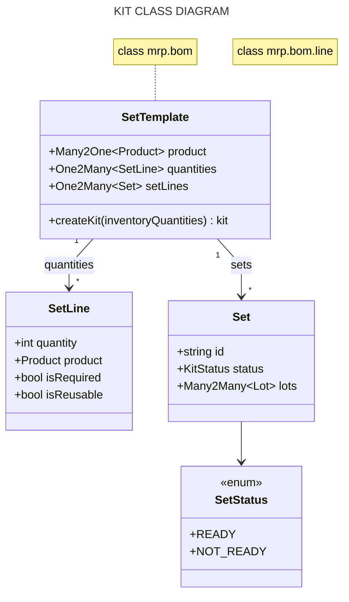
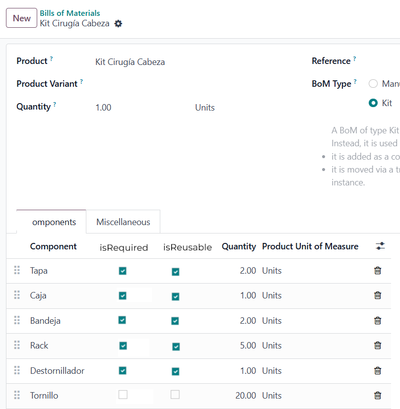
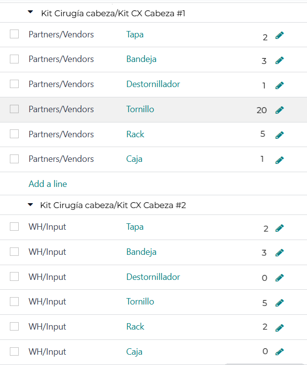
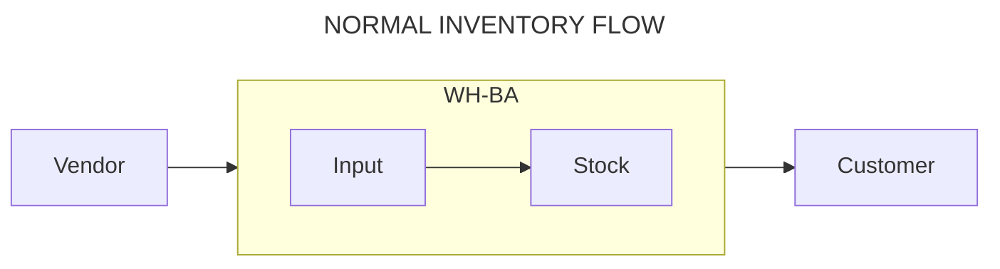
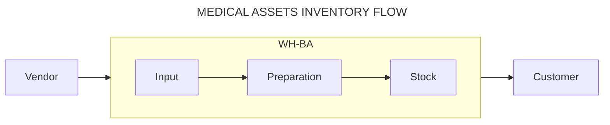
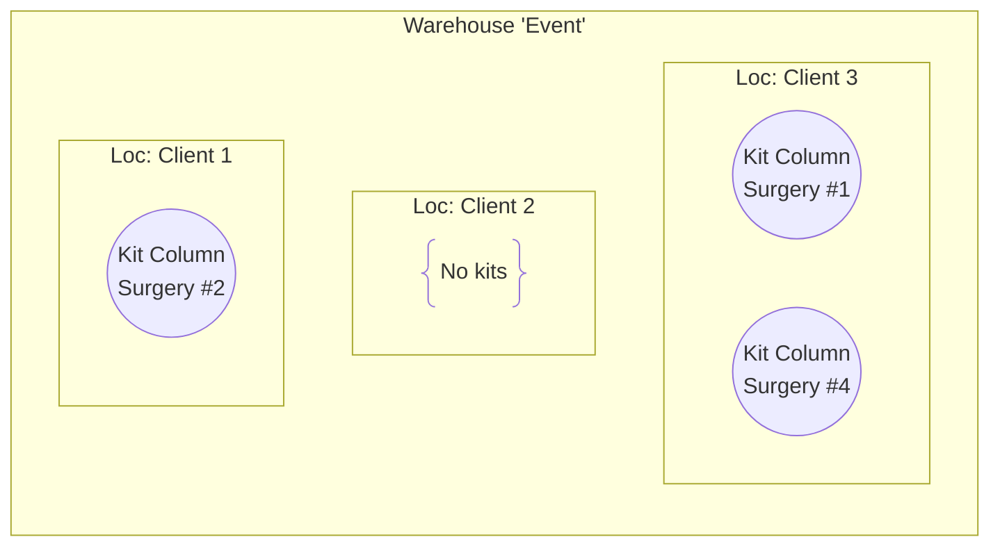

# Kits

## Class diagram

## Set up

- [x] 1. Create a kit template (**KitTemplate**) where the quantities of the products are determined.

- [ ] 2. Add the booleans `is_required` (required products) and `is_reusable` (products that will return to stock) to the [“KitQuantity”](#class-diagram) model.

> Example of boolean vars on `mrp.bom.line`

- [ ] 3. Create the [“Kit”](#class-diagram)[^package] model with the following:

- Tracking ID
- _status_: preparation status with `ready` and `not_ready` values.
- List of batches (products).

- [x] 4. Validate in **Inventory** that there are sufficient batch quantities to assemble the kit (already implemented in the manufacturing module).

## Tracking

- [ ] 1. Create a new **Inventory** view where you can display the locations and in them the products and kits. The kits should look like drop-down lists of products with their quantities.

> Example of kits as droppable lists of products on custom view

## Inventory flow

### Kits input

The kits are products that require a preparation process for their use. The inventory is conceived as a 2-step input inventory where (see above diagram):

- Most products will go from **In** to **Stock** automatically.
- By product or product category each of the components of the kits will go from **In** to **Preparation** automatically; after cleaning they will go manually to **Stock**.

### Kits output

The business model is based on charging mostly for the use on surgical purposes of the kit and very little for the purchase of the components of a kit.

At the inventory level, kits will be transported as a whole to customer locations from a warehouse called “Event”:

1. Prior to surgery, kits are transported to the customer location.
2. The use of the products specified on the expense sheet is charged.
3. After the surgery, the products with `is_reusable` = true and `is_required` = true that have not been purchased are returned.
4. The products arrive at the **Input** location of the warehouse from where they came from and by means of routing rules for _product_ or _product category_ are routed to **Preparation**.

# [:back:](../README.md)

[^package]: Revisar módulo de paquetes en Odoo
