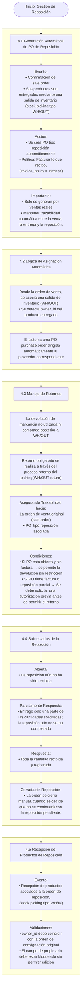

# Diagrama de Reposición

```mermaid
flowchart TD
    A0([Inicio: Gestión de Reposición])

    %% Grupo: Generación automática de PO por Reposición
    subgraph grupo1 [ ]
        T1["4.1 Generación Automática de PO de Reposición"]
        A1["Evento:<br>• Confirmación de sale.order<br>• Sus productos son entregados mediante una salida de inventario (stock.picking tipo WH/OUT)"]
        A2["Acción:<br>• Se crea PO tipo reposición automáticamente<br>• Política: Facturar lo que recibo,<br> (invoice_policy = 'receipt')."]
        A3["Importante:<br>• Solo se generan por ventas reales<br>• Mantener trazabilidad automática entre la venta, la entrega y la reposición."]
    end

    %% Grupo: Lógica de asignación automática
    subgraph grupo2 [ ]
        T2["4.2 Lógica de Asignación Automática"]
        A4["Desde la orden de venta, se asocia una salida de inventario (WH/OUT):<br>• Se detecta owner_id del producto entregado"]
        A5["El sistema crea PO purchase.order dirigida automáticamente al proveedor correspondiente"]
    end

    %% Grupo: Manejo de retornos
    subgraph grupo3 [ ]
        T3["4.3 Manejo de Retornos"]
        A6["La devolución de mercancia no utilizada ni comprada posterior a WH/OUT "]
        A7["Retorno obligatorio se realiza a través del proceso retorno del picking(WH/OUT return)"]
        A8["Asegurando Trazabilidad hacia:<br>• La orden de venta original (sale.order)<br>• PO  tipo reposición asociada"]
        A9["Condiciones:<br>• Si PO está abierta y sin factura → se permite la devolución sin restricción<br>• Si PO tiene factura o reposición parcial → Se debe solicitar una autorización previa antes de permitir el retorno"]
    end

    %% Grupo: Sub-estados de reposición
    subgraph grupo4 [ ]
        T4["4.4 Sub-estados de la Reposición"]
        A10["Abierta:<br>• La reposición aún no ha sido recibida"]
        A11["Parcialmente Respuesta:<br>• Entregó sólo una parte de las cantidades solicitadas; la reposición aún no se ha completado"]
        A12["Respuesta:<br>• Toda la cantidad recibida y registrada"]
        A13["Cerrada sin Reposición:<br>• La orden se cierra manual, cuando se decide que no se continuará con la reposición pendiente."]
    end

    %% Grupo: Recepción de productos de reposición
    subgraph grupo5 [ ]
        T5["4.5 Recepción de Productos de Reposición"]
        A14["Evento:<br>• Recepción de productos asociados a la orden de reposición,<br>(stock.picking tipo WH/IN)"]
        A15["Validaciones:<br>• owner_id debe coincidir con la orden de consignación original<br>• El campo de propietario debe estar bloqueado sin permitir edición"]
    end

    %% Flujo general
    A0 --> T1 --> A1 --> A2 --> A3 --> T2 --> A4 --> A5 --> T3 --> A6 --> A7 --> A8 --> A9 --> T4 --> A10 --> A11 --> A12 --> A13 --> T5 --> A14 --> A15
```